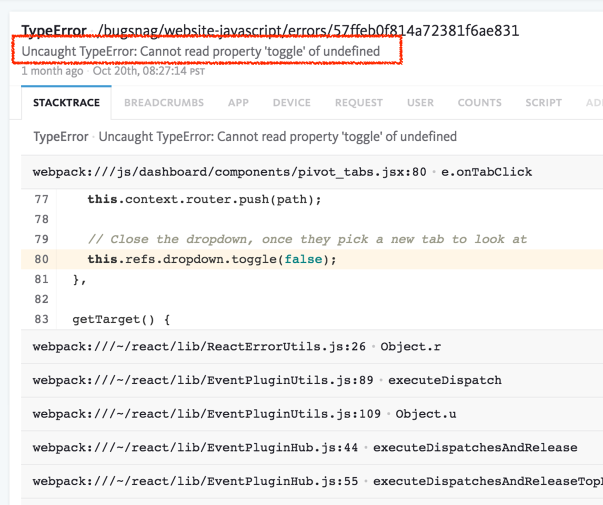
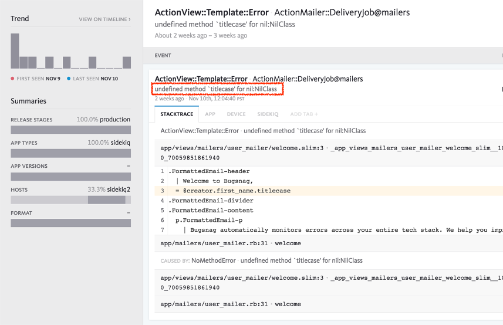

autoscale: true  
slidenumbers: true  
theme: Next, 3

# [fit] Defensive
# [fit] Programming[^*]

<br/>

```swift
let author = "Konstantin Portnov"
let github = "github.com/x0000ff"
```

<br/>


[^*]: Nokia 3310

---

## Why Nokia 3310?
### September 1, 2000


https://en.wikipedia.org/wiki/Nokia_3310

---


> http://images.ahoranoticias.cl/2017/02/14/190313_7_58a32a404b519.jpg

---


> http://i.computer-bild.de/imgs/4/3/7/6/7/3/8/Nokia-3310-745x559-37dcbd46bb4f4a7b.jpg

---


> http://www.panmedia.com.jm/files/images/blog/12-reasons-nokia-3310/nokia_3310.jpg

---


> http://i0.kym-cdn.com/photos/images/facebook/000/232/787/4aa.jpg

---


> https://img.memecdn.com/nokia-3310-a-weapon_o_195512.jpg

---


> https://pics.me.me/iphone-samsung-nokia-3310-17000637.png

---

## Why?

# 😐

---

# 😱 5522 crashes

**NSInvalidArgumentException**

```objectivec
-[__NSCFConstantString containsString:]: 
unrecognized selector sent to instance 0x3b34bae0
```


---

# JavaScript



---

# Whatever



---

# 🤔

---

# What’s the problem?

Part of JSON response 


---

# 🤔

---

# Code Complete
## `Steve McConnell`


---

# Do Not Ignore Errors & Warnings


---

# 👻

## “The whole point of defensive programming is guarding against errors you don’t expect”

    - Page 197, “Code Complete”

---

# 🕵🏻
# Check Input Data

---

# Check Input Data


---

# Check Input Data


---

# 👮🏻
# “Barricade Your Program to Contain the Damage Caused by Errors”.

    - Page 203, “Code Complete”


---

# Create Safe Areas

## Barricades are a damage-containment strategy.

One way to barricade for defensive programming purposes is to designate certain interfaces as boundaries to “safe” areas. Check data crossing the boundaries of a safe area for validity, and respond sensibly if the data isn’t valid.

---

# Create Safe Areas[^*]


[^*]: Page 204, “Code Complete”

---

# Convert input data to the proper type at input time

| External | Internal |
|---|---|
| JSON | Model Object |
| `ok` | true
| `failed` | false |
| `4.300` | 4.3 |
| `3 USD` | `{ [Amount] Value: 3; Currency: USD }` |

---

# 💩
# Garbage IN
# Garbage OUT

---

# No one crash in Production


---

# But! Make errors annoying


---

# Code Complete
## `Steve McConnell`
### Chapter 8: Defensive Programming


---

# Q & A
# 🤔

---

# Thanks a lot!

☺️


---

# **Me...**


-  Konstantin Portnov 

-  [http://about.me/x0000ff](http://about.me/x0000ff)

-  [https://github.com/x0000ff](https://github.com/x0000ff)

-  [https://twitter.com/x0000ff](https://twitter.com/x0000ff)

-  [https://www.linkedin.com/in/KonstantinPortnov](https://www.linkedin.com/in/KonstantinPortnov)

---

# This Presentation
# 🙂
# http://bit.ly/2zZkCCD

---

# EOF
# 🍻