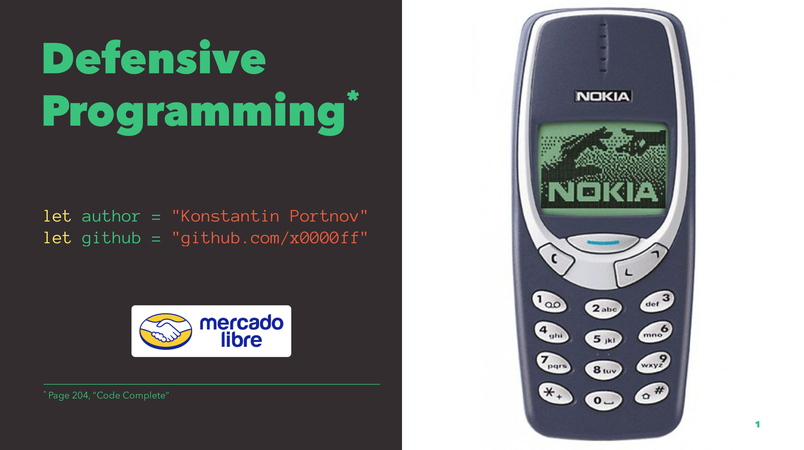

# Defensive Programming

## It's about...

How to make your code more stable and robust

## Presented on...

- [Software Crafters Chile @ 22/11/2017](https://www.meetup.com/Software-Crafters-Chile/events/244929836/)
- [iOS Love Meetup [Julio 2018] @ 24/07/2018](https://www.meetup.com/iOSLove/events/252920298/)

## Output

- [Source](./Defensive%20Programming.md)
- [Generated PDF](./Defensive%20Programming.pdf)

> Presentation was made with [Deckset](https://www.decksetapp.com) and [MacDown](https://macdown.uranusjr.com/)
